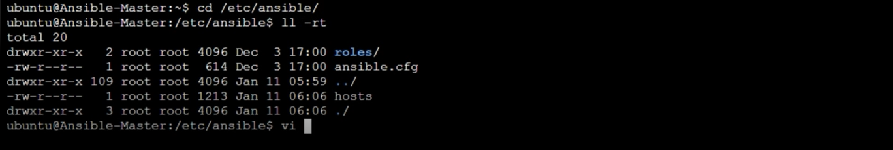

# Ansible .inventory
 it can be written in two formats. **inventory.ini** or **Yaml**. 
 # Inventory.ini 

      server1 ansible_host=192.168.1.10 ansible_user=ubuntu
      server2 ansible_host=192.168.1.11 ansible_user=ubuntu
      server3 ansible_host=192.168.1.12 ansible_user=ubuntu

 ## Use INI when:

   - You're just getting started with Ansible

   - You have a small number of hosts/groups

   - You want a quick, flat inventory

## Use YAML when:
You’re managing large-scale or cloud infrastructure

  * You need nested groups, complex variables, or dynamic inventory

  * You're using inventory plugins (e.g., AWS EC2, Azure, Kubernetes, etc.)

 On most Ubuntu systems, the default static inventory file is located at:

   ## bash:

              etc/ansible/hosts
              sudo vi /etc/ansible/hosts    # to edit this file

This folder usually contains:

- `ansible.cfg`: The main configuration file for Ansible
- `hosts`: The default static inventory file
- `roles/`: A directory to organize reusable role definitions

# 📝 Edit the Inventory File
To manage your nodes, you need to edit the Ansible hosts file on the control node and add a group with the public IP addresses of the managed nodes.

Navigate to the hosts file:

       sudo vi /etc/ansible/hosts
       [production]
       slave1 ansible_host=35.154.228.102
       slave2 ansible_host=65.2.80.252

* production: This is the group name of your managed nodes.

* slave1 and slave2: These are the hostnames for the nodes.

* ansible_host: Specifies the public IP address to connect to for each node.
# Grouped Inventory
Grouped inventory in Ansible is a way to organize hosts (servers) into named groups in the inventory file. This allows you to managed-nodes and target sets of related machines easily — such as web servers, database servers, or all production machines. You can also create groups of groups (called children groups) to combine multiple groups under one name.

## Why Use Grouped Inventory?
 - Organize infrastructure logically (by role, environment, etc.)

 - Reuse playbooks by applying them to groups

 - Apply group-specific variables and configurations

 - Easily scale up and manage large systems

 ## Example for Grouped Inventory

  
    all:
    children:
    webservers:
      hosts:
        master_node:
          ansible_user: ubuntu
          ansible_host: 10.0.0.1  # Private IP of master_node
        slave1:
          ansible_user: ubuntu
          ansible_host: 172.78.0.101
        slave2:
          ansible_user: ubuntu
          ansible_host: 172.35.6.102

    dbservers:
      hosts:
        db_1:
          ansible_user: ubuntu
          ansible_host: 172.89.7.103

    appstack:
      children:
        webservers:
        dbservers:

      

